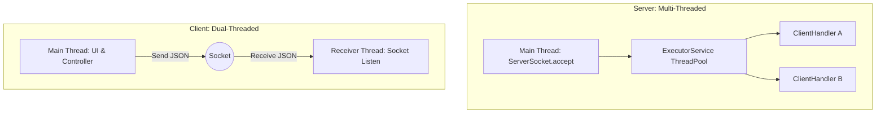
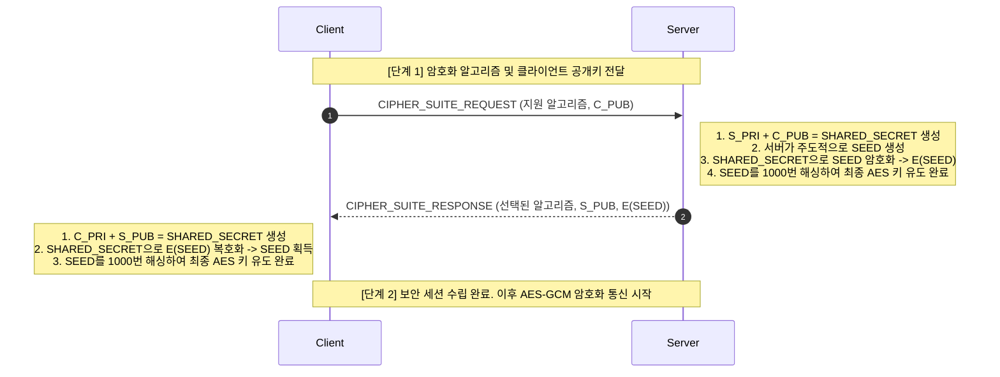
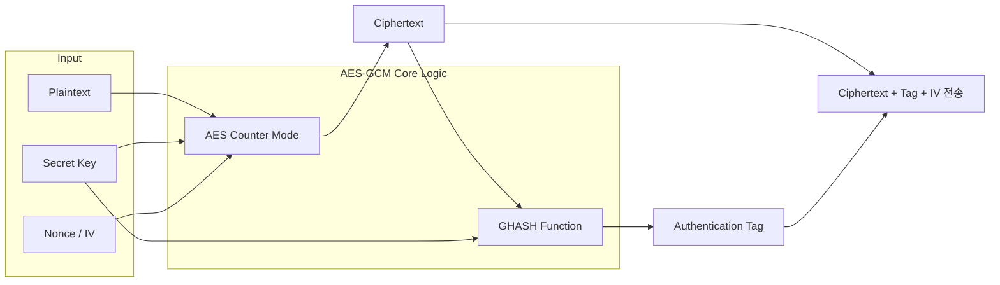
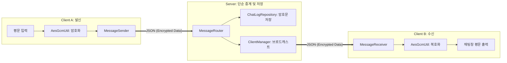

# 🔒 PolyTalk: E2EE 기반 보안 채팅 시스템 (광명폴리텍 자바 심화 과제)

**광명폴리텍 자바 심화 과정** 과제로 진행한 **종단간 암호화(End-to-End Encryption, E2EE)** 기반의 1:1 보안 채팅 시스템입니다.

일반적인 채팅 시스템은 서버가 메시지의 평문을 모두 읽고 저장할 수 있어 프라이버시 침해나 서버 해킹 시 데이터 유출의 위험이 있습니다. 본 프로젝트는 **"서버는 단지 암호문을 중계할 뿐, 내용은 절대 해독할 수 없어야 한다"**는 교수님의 핵심 요구사항을 충족하기 위해 클라이언트 주도의 암호화 구조를 설계하고 구현했습니다.

## 🛠 Tech Stack

- **Language**: Java 21
- **Build Tool**: Gradle
- **Network**: Java Socket API (TCP), Multi-threading
- **Library**
    - `jbcrypt` (비밀번호 해싱)
    - `jackson-databind` (객체-JSON 직렬화/역직렬화)
    - `slf4j` & `logback-classic` (로깅 처리)
    - `lombok` (보일러플레이트 코드 제거)
- **Test**: JUnit 5, AssertJ, Mockito

---

## 🚀 실행 방법 (How to Run)

본 프로젝트는 서버 1대와 다수의 클라이언트가 통신하는 구조입니다. IntelliJ IDEA 등의 IDE 환경에서 아래 순서대로 실행합니다.

### 1. 서버 실행

- `com.polytalk.server.ChatServer` 클래스를 찾아 `main` 메서드를 실행합니다.
- 포트 `5000`번에서 서버가 클라이언트의 접속을 대기합니다.

### 2. 클라이언트 실행

- 테스트를 위해 `com.polytalk.client.ClientA`와 `com.polytalk.client.ClientB` 클래스의 `main` 메서드를 각각 실행하여 두 개의 클라이언트 창을 띄웁니다.

### 3. 채팅 테스트

- 각 클라이언트 창에서 `2. 회원가입`을 진행한 후 `1. 로그인`합니다.
- 한 클라이언트가 방을 생성하면, 다른 클라이언트가 해당 방 번호와 비밀번호를 입력해 입장합니다.
- 자동으로 공개키가 교환되며, 이후 안전한 E2EE 비밀 대화가 가능합니다.

---

# ✨ 주요 기능 (Key Features)

- **계정 및 인증**
    - ID/PW 기반 회원가입 및 로그인 (BCrypt 비밀번호 단방향 해싱)
    - 회원가입 시 ECDH 암호화 키 쌍(Public/Private Key) 자동 생성 및 로컬 저장
- **채팅방 관리**
    - 실시간 생성된 채팅방 목록 조회
    - 비밀번호가 설정된 1:1 프라이빗 채팅방 생성 및 입장
    - 방 폭파 기능 (폭파 시 서버 내 파일 로그 즉시 영구 삭제)
- **보안 통신 (E2EE)**
    - 채팅방 입장 시 타원곡선(ECDH) 알고리즘을 통한 1:1 세션 키 자동 교환
    - AES-128-GCM 알고리즘을 사용한 메시지 암호화/복호화 및 무결성 검증
    - 이전 대화 내역(History) 암호화 로드 기능

---

## 📁 프로젝트 구조 (Directory Structure)

```text
PolyTalk/
├── data/                         # 서버 데이터 저장소 (JSON 파일)
│   ├── members.json
│   ├── chat_rooms.json
│   └── chat_logs.json
├── client_keys/                  # 클라이언트 로컬 키 저장소 (개인키, 공개키)
├── build.gradle                  # 그레이들 빌드 설정
├── logs                          # 로깅
└── src/
    ├── main/java/com/polytalk/
    │   ├── client/               # [Client] 클라이언트 애플리케이션 계층
    │   │   ├── controller/       # 흐름 제어 (AuthFlow, RoomFlow, ChatRoom)
    │   │   ├── factory/          # 의존성 주입 및 객체 생성 (ClientFactory)
    │   │   ├── network/          # 소켓 통신 (Sender, Receiver, SocketClient)
    │   │   ├── service/          # 비즈니스 로직 (Auth, Room, Chat, Security, Handshake)
    │   │   ├── state/            # 클라이언트 전역 상태 관리 (ClientState)
    │   │   ├── ui/               # 콘솔 UI 출력 (ConsoleUI 등)
    │   │   └── ClientApp.java    # 클라이언트 실행 진입점 (ClientA, ClientB)
    │   │
    │   ├── server/               # [Server] 서버 애플리케이션 계층
    │   │   ├── factory/          # 서버 의존성 주입 (ServerFactory)
    │   │   ├── repository/       # 파일 기반 데이터 영속화 (Member, Room, Log)
    │   │   ├── service/          # 서버 비즈니스 로직 및 브로드캐스트
    │   │   ├── ChatServer.java   # 서버 소켓 실행 진입점
    │   │   ├── ClientHandler.java# 개별 클라이언트 소켓 스레드
    │   │   ├── ClientManager.java# 접속자 관리 및 브로드캐스트
    │   │   └── ServerMessageRouter.java # 메시지 타입별 서비스 라우팅
    │   │
    │   ├── controller/           # [Common] 공통 컨트롤러 계층
    │   ├── service/              # [Common] 공통 서비스 계층
    │   │
    │   ├── crypto/               # [Crypto] 암호화 핵심 유틸리티
    │   │   ├── AesGcmUtil.java       # 대칭키 암호화
    │   │   ├── EcdhUtil.java         # 키 교환 알고리즘
    │   │   ├── KeyDerivationUtil.java# PBKDF2 키 유도
    │   │   ├── FingerprintUtil.java  # 공개키 지문 생성
    │   │   └── ...
    │   │
    │   ├── domain/               # [Domain] 핵심 데이터 모델
    │   │   └── Member.java, ChatRoom.java, ChatLog.java
    │   │
    │   └── protocol/             # [Protocol] 통신 규약
    │       ├── Message.java      # 표준 통신 객체
    │       ├── MessageType.java  # 요청/응답 타입 Enum
    │       └── JsonUtil.java     # Jackson 직렬화 처리
    │
    └── test/java/com/polytalk/   # [Test] 단위 테스트 (JUnit5, AssertJ)
        ├── client/
        │   ├── service/
        │   │   └── ClientChatServiceTest.java   # 클라이언트 채팅 로직 테스트
        │   └── state/
        │       └── ClientStateTest.java         # 클라이언트 상태 관리 테스트
        │
        ├── crypto/
        │   ├── AesGcmUtilTest.java              # AES-GCM 암복호화 무결성 테스트
        │   └── EcdhUtilTest.java                # ECDH 키 교환 알고리즘 테스트
        │
        ├── domain/
        │   └── ChatRoomTest.java                # 채팅방 도메인 로직 테스트
        │
        └── service/
            ├── ClientChatServiceTest.java       # 공통 채팅 서비스 테스트
            └── ServerChatServiceTest.java       # 서버 암호문 중계 및 저장 로직 테스트
```

## 🏗 시스템 아키텍처 및 통신 구조

클라이언트와 서버는 독립적인 멀티스레드 환경에서 동작하며, 모든 요청은 `Router`를 거쳐 각 `Service`로 분기되는 계층형(Layered) 아키텍처를 따릅니다.



---

## 🔒 핵심 보안 설계 (Security Design)

PolyTalk의 핵심은 클라이언트 주도의 암호화 처리입니다. 서버는 사용자의 공개키만 보관하며, 개인키는 클라이언트 로컬에만 존재합니다.

### 1. 보안 연결(Handshake) 및 세션 키 생성

과제 요구사항에 명시된 대로, 클라이언트가 접속하면 서버가 주도적으로 SEED를 생성하여 암호화한 뒤 내려주는 방식으로 세션 키를 공유합니다.



### 2. 암호화 설계 주안점 및 결정 근거

#### Q1. 왜 AES-CBC가 아닌 AES-GCM을 사용했는가?

초기 기획 단계에서는 흔히 쓰이는 AES-CBC 방식을 고려했습니다. 하지만 CBC 모드는 데이터의 기밀성(Confidentiality)은 보장하지만, 무결성(Integrity)은 보장하지 않아 패딩 오라클 공격(Padding Oracle Attack) 등에 취약하다는 것을 알게 되었습니다.

따라서, 인증된 암호화(AEAD)를 지원하여 메시지가 전송 도중 위변조되지 않았음을 수학적으로 검증(Authentication Tag)할 수 있는 AES-GCM 모드를 채택했습니다.



#### Q2. 왜 서버에서 메시지를 복호화하지 않는가?

카카오톡이나 텔레그램 일반 채팅의 경우, 서버가 메시지를 받아 복호화한 후 저장하고 다시 암호화하여 수신자에게 보냅니다. 이는 서버 관리자가 맘만 먹으면 대화 내용을 볼 수 있다는 의미입니다.

본 시스템은 "서버 신뢰 제로(Zero-Trust)"를 전제로 합니다. 발신자(Client A)가 수신자(Client B)의 공개키를 이용해 직접 암호화하며, 서버(ChatLogRepository)는 의미를 알 수 없는 암호문만 단순 저장하고 브로드캐스트합니다.

---

## 💬 메시지 흐름도 (Message Flow)

1:1 채팅방에 입장하면 서버를 거쳐 서로의 공개키를 교환하고, 이후부터는 E2EE 암호화 통신이 시작됩니다.



---

## 🧨 트러블슈팅 및 향후 개선 계획

### 1. 동시성 문제: 파일 I/O 데이터 꼬임 현상 (Race Condition)

**문제 상황**: 초기 개발 시, 데이터베이스 없이 `chat_logs.json`과 `members.json` 파일을 사용하여 데이터를 관리했습니다. 다수의 클라이언트가 동시에 방을 생성하거나 메시지를 보낼 때, 스레드들이 동시에 파일을 읽고 쓰면서 데이터가 덮어씌워지거나 JSON 형식이 깨지는 심각한 문제가 발생했습니다.

**해결 방법**: Java의 `synchronized` 키워드를 파일 I/O를 담당하는 Repository의 주요 메서드(`save()`, `findAll()` 등)에 적용하여, 단일 JVM 내에서 파일 접근 시 상호 배제(Mutual Exclusion)가 이루어지도록 임시 조치했습니다.

**한계점 및 향후 계획**: 현재 `synchronized`를 통한 락(Lock) 방식은 트래픽이 늘어날 경우 심각한 병목 현상을 유발하며, 서버를 다중화(Scale-out)할 경우 전혀 방어되지 않습니다. 향후 이를 MySQL이나 Oracle 같은 RDBMS로 마이그레이션하여, DB 단의 트랜잭션과 격리 수준(Isolation Level)을 통해 동시성을 제어하는 방향으로 고도화할 계획입니다.

### 2. 세션 키의 주기적 갱신(PFS) 부재

현재는 방에 입장할 때 맺은 1:1 세션 키를 해당 방에 있는 동안 계속 사용합니다. 향후에는 일정 시간이나 일정 메시지 개수마다 키를 갱신하는 완전 순방향 비밀성(Perfect Forward Secrecy, PFS) 개념을 도입하여 보안성을 한층 더 끌어올릴 예정입니다.
