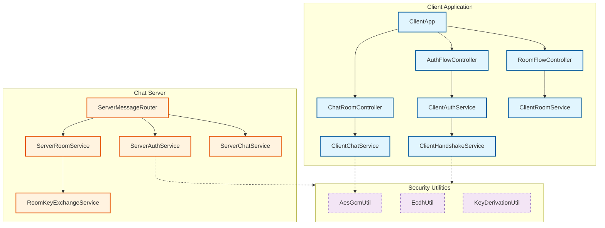
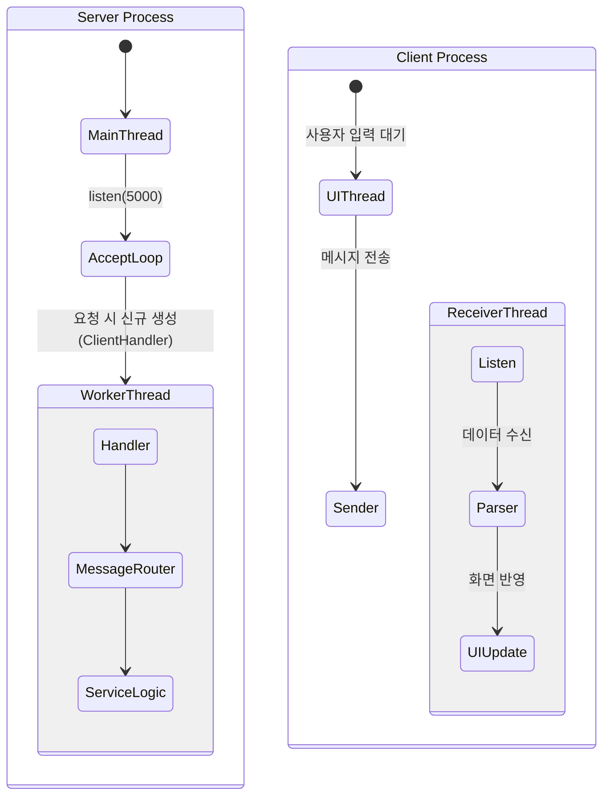
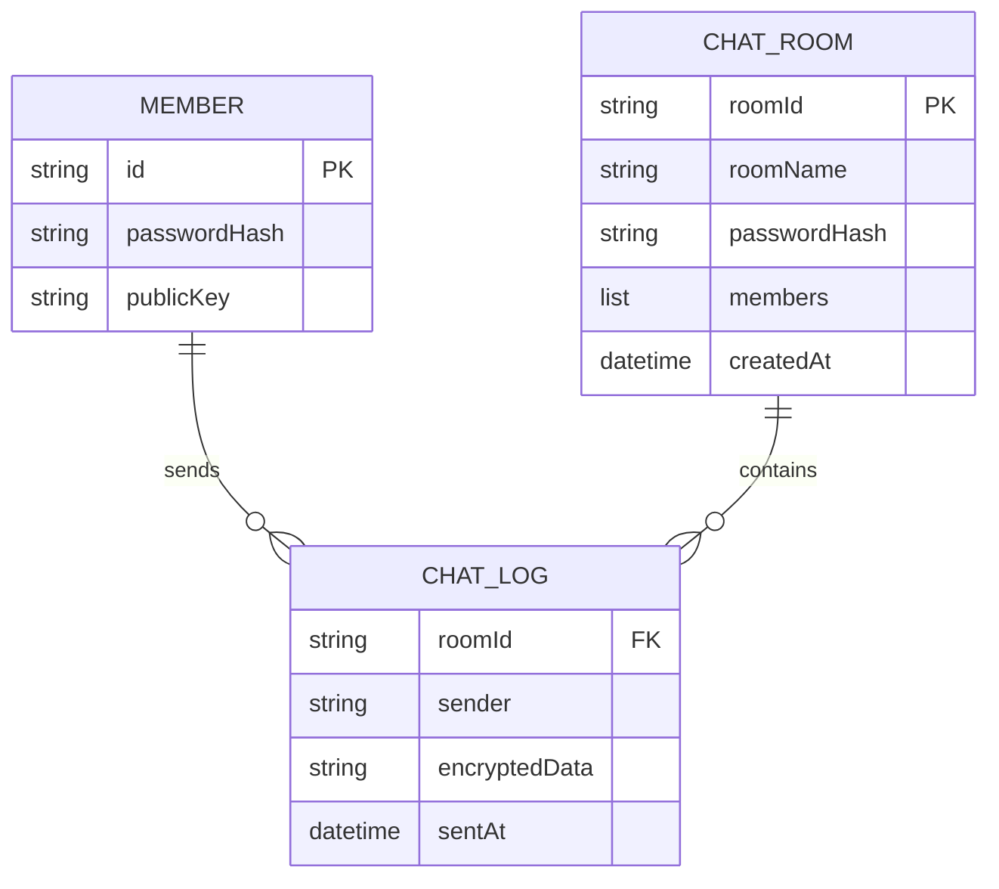
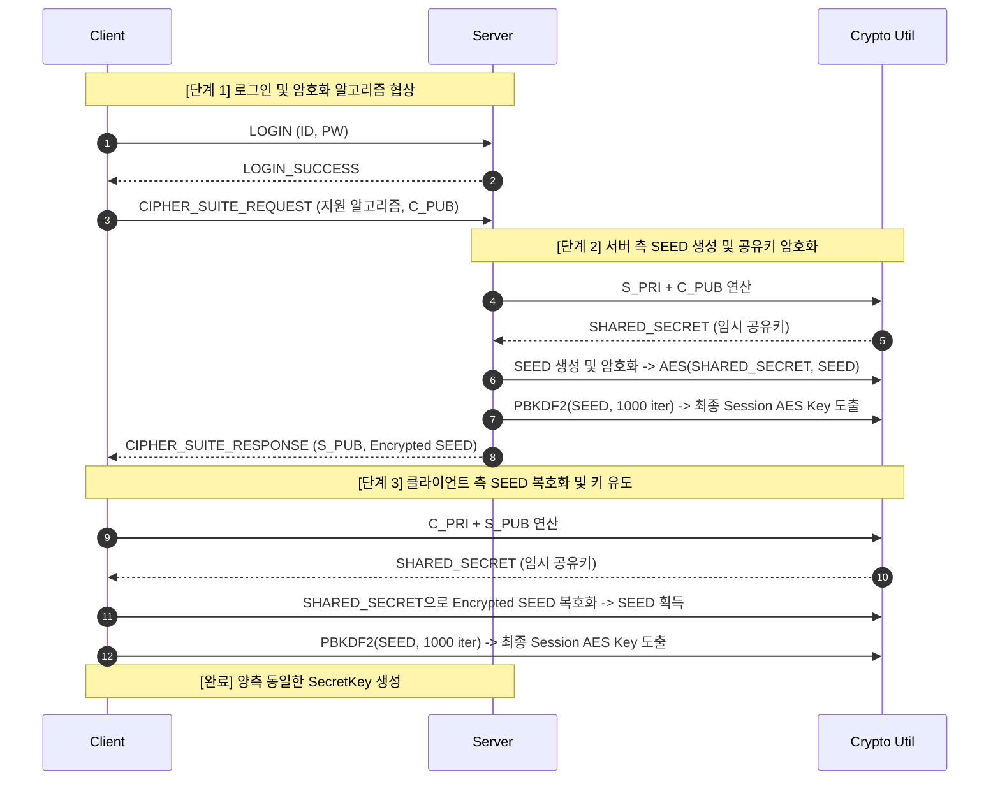
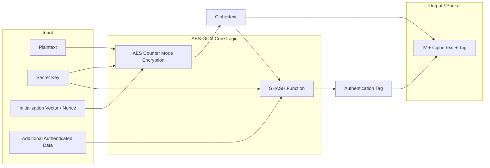
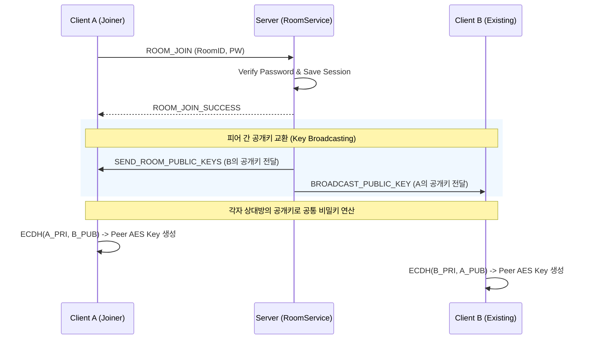
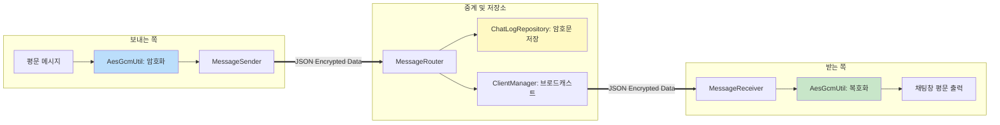

# 🔒 PolyTalk: E2EE 기반 보안 채팅 시스템

> **광명폴리텍 자바 심화 과정 과제**  
> 서버를 신뢰할 수 없는 환경(Zero-Trust)에서도 안전한 통신이 가능하도록 설계한 **종단간 암호화(End-to-End Encryption, E2EE) 기반 1:1 보안 채팅 시스템**입니다.

---

## 📌 프로젝트 개요

일반적인 채팅 시스템은 서버가 메시지의 평문을 처리하거나 저장할 수 있습니다. 이 구조에서는 서버 관리자, 서버 침해 사고, 로그 유출 등의 상황에서 사용자의 대화 내용이 노출될 수 있습니다.

PolyTalk는 이러한 문제를 해결하기 위해 **“서버는 암호문만 중계하고, 실제 메시지 내용은 클라이언트만 복호화할 수 있어야 한다”**는 목표로 설계되었습니다. 메시지 암호화와 복호화는 클라이언트에서 수행되며, 서버는 사용자 인증, 채팅방 관리, 암호문 저장, 암호문 전달 역할만 담당합니다.

---

## ✨ 주요 기능

### 1. 계정 및 인증

- ID/PW 기반 회원가입 및 로그인
- 비밀번호는 평문 저장 없이 `BCrypt` 기반 단방향 해싱 처리
- 회원가입 시 ECDH 암호화 키 쌍 자동 생성
- 개인키는 클라이언트 로컬에 저장
- 공개키는 서버를 통해 상대 클라이언트에게 전달

### 2. 채팅방 관리

- 실시간 생성된 채팅방 목록 조회
- 비밀번호가 설정된 1:1 프라이빗 채팅방 생성 및 입장
- 채팅방 입장 시 비밀번호 검증
- 방 폭파 기능 지원
- 방 폭파 시 서버 내 파일 로그 즉시 영구 삭제

### 3. 보안 통신

- 채팅방 입장 시 ECDH 기반 1:1 세션 키 교환
- AES-128-GCM 기반 메시지 암호화 및 복호화
- GCM 인증 태그를 통한 메시지 위변조 검증
- 서버는 메시지 평문을 알 수 없고 암호문만 중계 및 저장
- 이전 대화 내역도 암호화된 상태로 저장 및 로드

---

## 1. 설계 목적 및 요구사항

### 1.1 설계 목적

기존 채팅 시스템은 서버에서 메시지를 평문으로 처리하거나 저장하기 때문에, 서버가 침해되거나 로그가 유출될 경우 보안상 취약점이 발생합니다. PolyTalk는 이를 해결하기 위해 다음 원칙을 기준으로 설계되었습니다.

- 암호화는 클라이언트에서 수행
- 서버는 메시지를 단순 중계 및 암호문 저장만 수행
- 서버가 메시지 평문을 확인할 수 없는 구조 적용
- 세션 키 기반 암호화 통신 적용
- 공개키 기반 키 교환 구조 적용
- 클라이언트 중심 보안 구조 적용

### 1.2 시스템 요구사항

#### 기능 요구사항

- 사용자 ID 및 공개키 등록
- 사용자 로그인 인증
- 회원 간 1:1 비밀 대화
- 비밀번호 기반 프라이빗 채팅방 생성 및 입장
- 암호문 형태의 서버 로그 저장
- 채팅방 폭파 및 로그 삭제
- 이전 대화 내역 암호화 로드

#### 비기능 요구사항

- **보안성**: 서버에서 메시지 평문 확인 불가
- **무결성**: AES-GCM 인증 태그를 통한 메시지 위변조 방지
- **기밀성**: ECDH로 도출한 키 기반 암호화 통신
- **독립성**: 클라이언트 중심 보안 구조
- **확장성**: 프로토콜 기반 라우팅 구조를 통한 기능 확장 용이성 확보
- **동시성**: 멀티스레드 환경에서 파일 I/O 충돌 방지

---

## 2. Tech Stack

| 구분 | 기술 |
|---|---|
| Language | Java 17 또는 Java 21 |
| Build Tool | Gradle |
| Network | Java Socket API, TCP |
| Concurrency | Multi-threading |
| Password Hashing | jBCrypt |
| JSON Processing | Jackson Databind |
| Logging | SLF4J, Logback Classic |
| Boilerplate Reduction | Lombok |
| Test | JUnit 5, AssertJ, Mockito |
| Persistence | JSON File Storage |
| Encryption | ECDH, AES-128-GCM, PBKDF2 |

---

## 3. 실행 방법

### 3.1 서버 실행

`com.polytalk.server.ChatServer` 클래스의 `main` 메서드를 실행하여 서버를 먼저 구동합니다.

```text
Server Port: 5000
```

### 3.2 클라이언트 실행

두 개의 클라이언트를 각각 실행합니다.

```text
com.polytalk.client.ClientA
com.polytalk.client.ClientB
```

### 3.3 테스트 흐름

1. 서버 실행
2. ClientA 실행
3. ClientB 실행
4. 각 클라이언트에서 회원가입 진행
5. 로그인 진행
6. 채팅방 생성
7. 상대 클라이언트가 채팅방 입장
8. ECDH 기반 키 교환 수행
9. AES-GCM 기반 암호화 메시지 송수신 확인
10. 서버에는 평문이 아닌 암호문만 저장되는지 확인

---

## 4. 전체 시스템 구조 및 데이터 모델

### 4.1 애플리케이션 아키텍처

클라이언트와 서버는 계층형 구조를 가지며, 독립적인 멀티스레드 환경에서 동작합니다.



### 4.2 런타임 스레드 모델

서버는 클라이언트 요청마다 `ClientHandler` 기반 작업 스레드를 생성하여 처리합니다. 클라이언트는 사용자 입력 흐름과 서버 응답 수신 흐름을 분리하여 동작합니다.



### 4.3 데이터베이스 구조(JSON 영속화)

DBMS 대신 JSON 파일 기반으로 사용자, 채팅방, 채팅 로그를 영속화합니다.



---

## 5. 인증 및 키 교환 설계(Handshake)

### 5.1 키 구조 설계 기준

#### 개인키(Private Key)

- 절대 외부로 노출되지 않음
- 네트워크를 통해 전송하지 않음
- 클라이언트 로컬 `client_keys/` 디렉터리에 저장
- 상대방과의 공유 비밀키 계산에 사용

#### 공개키(Public Key)

- 서버에 등록 가능
- 서버를 통해 상대방에게 전달 가능
- 공개되어도 개인키를 역산할 수 없음
- ECDH 키 교환 과정에서 사용

### 5.2 서버-클라이언트 세션 키 공유 과정

과제 다이어그램 요구사항에 따라, 서버가 주도적으로 SEED를 생성하고 암호화하여 클라이언트에게 전달하는 1단계 Handshake 방식을 구현했습니다.



> 서버-클라이언트 세션 키는 초기 로그인 이후 프로토콜 보호 및 안전한 제어 메시지 처리에 사용됩니다. 실제 1:1 채팅 메시지는 피어 간 ECDH로 도출한 별도 키를 통해 암호화되므로, 서버는 최종 채팅 평문을 알 수 없습니다.

---

## 6. 메시지 암호화 설계(AES-GCM)

### 6.1 암호화 방식 및 결정 근거

PolyTalk는 실시간 채팅에 적합한 빠른 암호화 성능을 확보하기 위해 대칭키 암호화 방식을 사용합니다. 그중에서도 AES-128-GCM을 채택했습니다.

#### AES-128-GCM 채택 이유

- 대칭키 기반이므로 실시간 채팅에 적합한 성능 제공
- GCM 모드는 AEAD(Authenticated Encryption with Associated Data)를 지원
- 암호화와 무결성 검증을 동시에 수행 가능
- 메시지가 전송 중 조작되면 인증 태그 검증 실패로 복호화 차단 가능
- CBC 모드처럼 별도의 MAC 구성이 필요하지 않음



### 6.2 1:1 대화방 입장 및 P2P 키 교환(E2EE)

방에 입장하면 서버를 통해 상대방의 공개키를 전달받고, 각 클라이언트는 상대방의 공개키와 자신의 개인키를 사용해 공통 비밀키를 계산합니다. 이 과정에서 서버는 키 교환을 중계하지만, 최종 피어 간 AES 키는 알 수 없습니다.



### 6.3 메시지 전송 흐름도

메시지 송신 클라이언트는 평문 메시지를 AES-GCM으로 암호화한 뒤 서버로 전송합니다. 서버는 메시지 내용을 복호화하지 않고 암호문 그대로 저장 및 브로드캐스트합니다. 수신 클라이언트는 자신의 피어 세션 키로 암호문을 복호화하여 평문을 화면에 출력합니다.



---

## 7. 프로젝트 디렉터리 구조

```text
PolyTalk/
├── data/                         # 서버 데이터 저장소(JSON 파일)
│   ├── members.json              # 회원 정보 및 공개키 저장
│   ├── rooms.json                # 채팅방 정보 저장
│   └── chat_logs/                # 채팅방별 암호문 로그 저장
│
├── client_keys/                  # 클라이언트 로컬 키 저장소
│   ├── {userId}_private.key      # 개인키
│   └── {userId}_public.key       # 공개키
│
├── src/main/java/com/polytalk/
│   ├── client/                   # 클라이언트 애플리케이션 계층
│   │   ├── ClientApp             # 클라이언트 실행 및 객체 조립 진입점
│   │   ├── ClientA               # 테스트용 클라이언트 A 실행 클래스
│   │   ├── ClientB               # 테스트용 클라이언트 B 실행 클래스
│   │   ├── controller/           # 인증/방/채팅 흐름 제어
│   │   ├── service/              # 클라이언트 비즈니스 로직
│   │   ├── network/              # SocketClient, MessageSender, ResponseReader
│   │   ├── state/                # 클라이언트 상태 관리
│   │   ├── ui/                   # 콘솔 UI
│   │   └── factory/              # 클라이언트 객체 생성 및 조립
│   │
│   ├── server/                   # 서버 애플리케이션 계층
│   │   ├── ChatServer            # 서버 실행 진입점
│   │   ├── handler/              # ClientHandler 등 클라이언트 요청 처리
│   │   ├── router/               # ServerMessageRouter
│   │   ├── service/              # 인증/방/채팅 서버 로직
│   │   ├── repository/           # JSON 파일 저장소 접근
│   │   └── manager/              # 접속 클라이언트 및 방 세션 관리
│   │
│   ├── crypto/                   # 암호화 핵심 유틸리티
│   │   ├── AesGcmUtil            # AES-GCM 암호화/복호화
│   │   ├── EcdhUtil              # ECDH 키 교환
│   │   └── KeyDerivationUtil     # PBKDF2 기반 키 유도
│   │
│   ├── domain/                   # 핵심 데이터 모델
│   │   ├── Member
│   │   ├── ChatRoom
│   │   └── ChatLog
│   │
│   └── protocol/                 # 통신 규약
│       ├── Message               # 요청/응답 메시지 객체
│       ├── MessageType           # 프로토콜 타입 Enum
│       └── JsonUtil              # JSON 직렬화/역직렬화
│
├── src/test/java/com/polytalk/   # 테스트 코드
├── build.gradle                  # Gradle 빌드 설정
├── settings.gradle               # Gradle 프로젝트 설정
└── README.md                     # 프로젝트 설명 문서
```

---

## 8. 주요 패키지 역할

### 8.1 client

클라이언트 실행, 사용자 입력 처리, 서버 요청 전송, 서버 응답 수신, 채팅 메시지 암호화 및 복호화를 담당합니다.

- `ClientApp`: 클라이언트 실행 흐름 관리
- `controller`: 인증, 채팅방, 채팅 흐름 제어
- `service`: 클라이언트 측 비즈니스 로직 처리
- `network`: 서버와의 소켓 통신 처리
- `ui`: 콘솔 기반 입출력 처리
- `factory`: 객체 생성 및 의존성 조립

### 8.2 server

서버 실행, 클라이언트 접속 처리, 메시지 라우팅, 인증, 채팅방 관리, 암호문 저장 및 브로드캐스트를 담당합니다.

- `ChatServer`: 서버 진입점
- `ClientHandler`: 클라이언트별 요청 처리 스레드
- `ServerMessageRouter`: 메시지 타입에 따른 서비스 분기
- `ServerAuthService`: 회원가입 및 로그인 처리
- `ServerRoomService`: 채팅방 생성, 입장, 폭파 처리
- `ServerChatService`: 암호문 메시지 저장 및 전달
- `Repository`: JSON 파일 기반 데이터 접근

### 8.3 crypto

보안 기능의 핵심 유틸리티를 담당합니다.

- `AesGcmUtil`: AES-GCM 암호화/복호화
- `EcdhUtil`: ECDH 키 쌍 생성 및 공유 비밀키 계산
- `KeyDerivationUtil`: PBKDF2 기반 AES 키 유도

### 8.4 domain

시스템의 핵심 데이터 모델을 정의합니다.

- `Member`: 회원 정보
- `ChatRoom`: 채팅방 정보
- `ChatLog`: 암호화된 채팅 로그

### 8.5 protocol

클라이언트와 서버가 주고받는 메시지 구조와 메시지 타입을 정의합니다.

- `Message`: 공통 요청/응답 객체
- `MessageType`: 요청/응답 구분 Enum
- `JsonUtil`: JSON 변환 유틸리티

---

## 9. 보안 설계 상세

### 9.1 비밀번호 보안

사용자의 비밀번호는 평문으로 저장하지 않습니다. 회원가입 시 `BCrypt`를 사용해 단방향 해시로 변환한 뒤 저장합니다.

```text
User Password -> BCrypt Hash -> members.json 저장
```

로그인 시에는 사용자가 입력한 비밀번호를 다시 해싱한 뒤 저장된 해시와 비교하는 방식이 아니라, BCrypt의 검증 함수를 통해 입력값과 저장된 해시의 일치 여부를 확인합니다.

### 9.2 공개키/개인키 관리

```text
Private Key: client_keys/ 로컬 저장, 외부 전송 금지
Public Key : 서버 등록 및 상대 클라이언트에게 전달 가능
```

개인키는 클라이언트 외부로 나가지 않기 때문에 서버가 탈취되더라도 피어 간 메시지 복호화에 필요한 키를 직접 얻을 수 없습니다.

### 9.3 ECDH 기반 공유 키 생성

ECDH는 양쪽 클라이언트가 서로의 공개키와 자신의 개인키를 사용해 동일한 공유 비밀값을 계산하는 방식입니다.

```text
Client A: ECDH(A_PRIVATE, B_PUBLIC) -> Shared Secret
Client B: ECDH(B_PRIVATE, A_PUBLIC) -> Shared Secret
```

두 결과는 동일하며, 이 값으로부터 AES 암호화 키를 도출합니다.

### 9.4 AES-GCM 기반 메시지 보호

AES-GCM은 암호화와 무결성 검증을 동시에 제공합니다.

```text
Plaintext Message
    -> AES-GCM Encrypt
        -> IV + Ciphertext + Authentication Tag
            -> Server Relay & Store
```

수신자는 인증 태그를 검증한 후에만 복호화할 수 있습니다. 전송 중 메시지가 조작되면 인증 검증에 실패하여 복호화가 차단됩니다.

---

## 10. 서버의 역할과 제한

PolyTalk에서 서버는 다음 역할만 수행합니다.

- 회원가입 및 로그인 요청 처리
- 사용자 공개키 저장 및 전달
- 채팅방 생성 및 입장 처리
- 채팅방 비밀번호 검증
- 클라이언트 간 공개키 교환 중계
- 암호문 메시지 저장
- 암호문 메시지 브로드캐스트
- 방 폭파 시 암호문 로그 삭제

서버가 수행하지 않는 역할은 다음과 같습니다.

- 채팅 메시지 평문 복호화
- 사용자의 개인키 보관
- 피어 간 최종 채팅 AES 키 직접 보유
- 평문 로그 저장

---

## 11. 프로토콜 흐름

### 11.1 회원가입 흐름

```text
Client
  -> Generate ECDH Key Pair
  -> Send REGISTER(id, password, publicKey)

Server
  -> Hash password with BCrypt
  -> Save member id, passwordHash, publicKey
  -> Return REGISTER_SUCCESS
```

### 11.2 로그인 흐름

```text
Client
  -> Send LOGIN(id, password)

Server
  -> Find member
  -> Verify password with BCrypt
  -> Return LOGIN_SUCCESS or LOGIN_FAIL
```

### 11.3 채팅방 생성 흐름

```text
Client
  -> Send ROOM_CREATE(roomName, roomPassword)

Server
  -> Hash room password
  -> Create room
  -> Save room metadata
  -> Return ROOM_CREATE_SUCCESS
```

### 11.4 채팅방 입장 흐름

```text
Client
  -> Send ROOM_JOIN(roomId, roomPassword)

Server
  -> Verify room password
  -> Add client session to room
  -> Send existing member public keys
  -> Broadcast new member public key
```

### 11.5 채팅 메시지 전송 흐름

```text
Sender Client
  -> Encrypt plaintext with peer AES key
  -> Send encrypted message

Server
  -> Store encrypted message
  -> Broadcast encrypted message

Receiver Client
  -> Receive encrypted message
  -> Decrypt with peer AES key
  -> Display plaintext
```

---

## 12. 트러블슈팅 및 고려사항

### 12.1 서버 신뢰 문제

#### 문제

일반적인 채팅 서버는 메시지 평문을 처리하거나 저장할 수 있어 서버가 신뢰 경계 안에 포함됩니다.

#### 해결

종단간 암호화(E2EE)를 적용하여 서버를 단순 중계자로 분리했습니다. 서버는 암호문만 저장하고 전달하므로 메시지 평문을 확인할 수 없습니다.

### 12.2 키 노출 방지

#### 문제

개인키가 서버나 네트워크로 전송되면 암호화 구조가 무너질 수 있습니다.

#### 해결

개인키는 클라이언트 로컬 `client_keys/` 디렉터리에만 저장하고, 네트워크로 전송하지 않습니다. 공개키만 서버를 통해 교환합니다.

### 12.3 확장성 및 유지보수

#### 문제

기능이 늘어날수록 요청 처리 로직이 복잡해질 수 있습니다.

#### 해결

`Message` 객체와 `MessageType` Enum을 활용한 프로토콜 기반 라우팅 구조를 도입했습니다. `ServerMessageRouter`가 메시지 타입에 따라 적절한 서비스로 요청을 위임하므로, 기능 추가 시 코드 수정 범위를 줄일 수 있습니다.

### 12.4 파일 I/O 동시성 제어(Race Condition)

#### 문제

DB 없이 JSON 파일을 사용하는 구조에서는 다수의 스레드가 같은 파일에 동시에 접근할 경우 데이터 덮어쓰기나 손상이 발생할 수 있습니다.

#### 해결

`synchronized` 블록을 활용하여 단일 JVM 내 파일 접근 동시성을 제어했습니다.

#### 한계 및 개선 방향

현재 방식은 단일 JVM 환경에서는 유효하지만, 트래픽 증가 또는 서버 스케일아웃 환경에서는 한계가 있습니다. 향후 Oracle 또는 MySQL 같은 RDBMS로 마이그레이션하여 트랜잭션 기반 동시성 제어를 적용할 계획입니다.

---

## 13. 테스트 관점

다음 항목을 중심으로 테스트할 수 있습니다.

### 인증 테스트

- 회원가입 성공
- 중복 ID 회원가입 실패
- 로그인 성공
- 잘못된 비밀번호 로그인 실패
- BCrypt 해시 검증 정상 동작 확인

### 키 교환 테스트

- ECDH 키 쌍 생성 확인
- A 클라이언트와 B 클라이언트의 Shared Secret 일치 확인
- 공개키 교환 후 Peer AES Key 생성 확인

### 암호화 테스트

- AES-GCM 암호화 결과가 평문과 다른지 확인
- 동일 키로 복호화 시 원문 복구 확인
- 암호문 변조 시 복호화 실패 확인
- IV, Ciphertext, Tag 조합 정상 처리 확인

### 채팅방 테스트

- 방 생성 성공
- 방 비밀번호 검증 성공/실패
- 방 입장 후 공개키 브로드캐스트 확인
- 방 폭파 시 로그 삭제 확인

### 서버 로그 테스트

- 서버 로그에 평문 메시지가 저장되지 않는지 확인
- 암호문 형태로만 저장되는지 확인
- 이전 대화 내역 로드 시 클라이언트에서만 복호화되는지 확인

---

## 14. 기대 효과

- 서버가 신뢰되지 않는 환경에서도 메시지 기밀성 유지
- 서버 침해 상황에서도 평문 메시지 유출 위험 감소
- AES-GCM을 통한 메시지 위변조 탐지
- ECDH 기반 동적 키 교환 구조 이해
- Java Socket, Multi-threading, JSON Persistence, Cryptography를 종합적으로 활용
- 프로토콜 기반 설계를 통한 유지보수성 확보

---

## 15. 향후 개선 방향

- JSON 파일 저장소를 Oracle 또는 MySQL 기반 RDBMS로 전환
- 트랜잭션 기반 채팅 로그 저장
- 다중 인원 채팅방 지원
- 공개키 위조 방지를 위한 인증서 또는 서명 구조 추가
- Perfect Forward Secrecy 강화를 위한 임시 키 교환 구조 고도화
- GUI 또는 WebSocket 기반 UI 확장
- 메시지 재전송 및 읽음 확인 기능 추가
- 사용자 차단 및 신고 기능 추가
- 배포 환경에서 TLS 적용

---

## 16. 핵심 요약

PolyTalk는 Java Socket 기반의 1:1 보안 채팅 시스템입니다. 사용자는 회원가입 시 ECDH 키 쌍을 생성하고, 채팅방 입장 시 상대방의 공개키를 받아 피어 간 AES 키를 계산합니다. 실제 메시지는 AES-128-GCM으로 암호화되어 서버로 전달되며, 서버는 평문을 알 수 없는 상태에서 암호문만 저장하고 중계합니다.

이 프로젝트는 단순 채팅 기능 구현을 넘어, 인증, 키 교환, 암호화, 무결성 검증, 멀티스레드 서버, JSON 영속화, 프로토콜 기반 라우팅을 통합한 보안 중심 채팅 시스템입니다.
