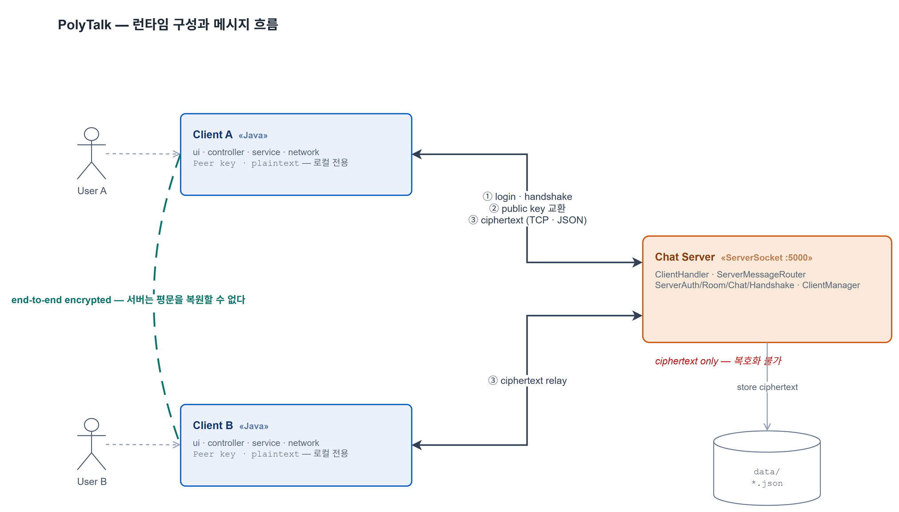
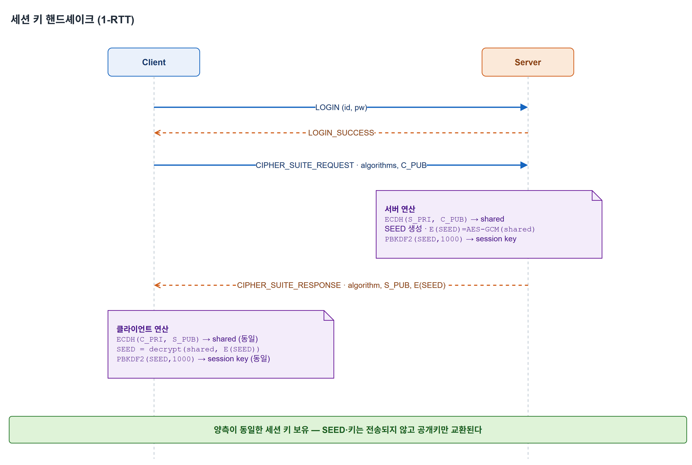
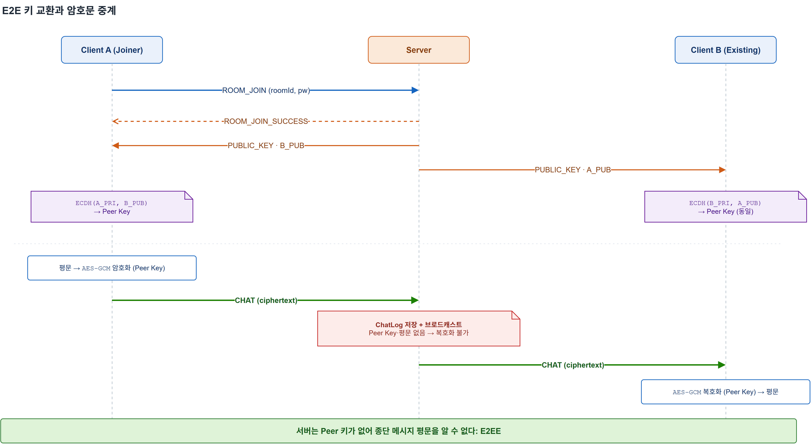
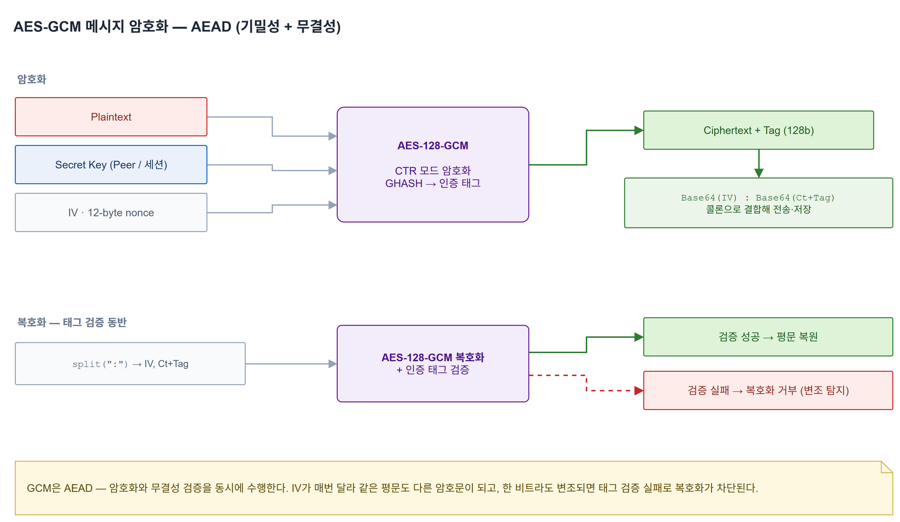
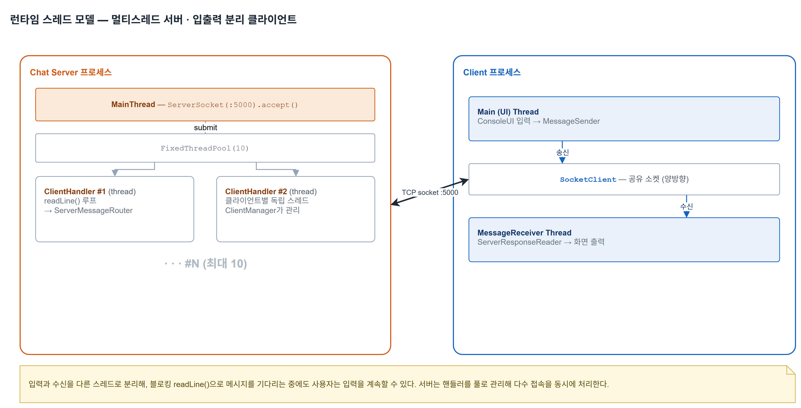
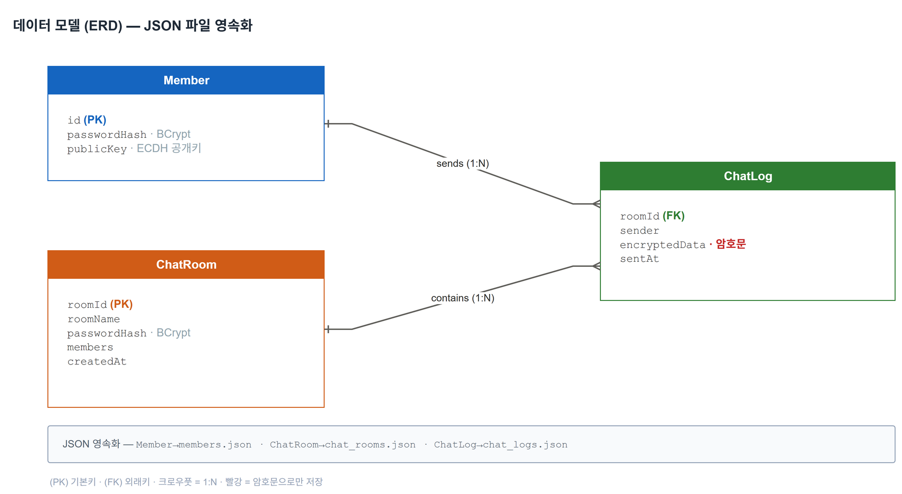

# PolyTalk — E2EE 기반 1:1 보안 채팅 시스템


[](https://github.com/SanghyeokLee-KR/polytalk/actions/workflows/ci.yml)

> 광명융합기술교육원 자바 심화 과제 · 종단간 암호화(E2EE) · **서버는 암호문만 중계한다**

> **이 프로젝트의 정의** — 서버를 신뢰할 수 없는 환경(Zero-Trust)을 가정하고, 서버가 메시지 평문을 절대 볼 수 없도록 설계한 1:1 보안 채팅이다. 암·복호화는 클라이언트에서만 일어나며, 서버는 사용자 인증·채팅방 관리·암호문 저장과 중계만 담당한다.

<details open>
<summary><b>목차 (클릭하여 접기/펴기)</b></summary>

<br>

**소개**
* [1. 프로젝트 개요](#1-프로젝트-개요)
* [2. 기술 스택](#2-기술-스택)
* [3. 디렉터리 구조](#3-디렉터리-구조)

**설계**
* [4. 시스템 아키텍처](#4-시스템-아키텍처)
* [5. 보안 설계 — 핸드셰이크 · E2EE · AES-GCM](#5-보안-설계--핸드셰이크--e2ee--aes-gcm)
* [6. 런타임 스레드 모델](#6-런타임-스레드-모델)
* [7. 데이터 모델](#7-데이터-모델)

**성과 및 회고**
* [8. 핵심 기능과 결과](#8-핵심-기능과-결과)
* [9. 한계와 개선점](#9-한계와-개선점)
* [10. 실무 확장 방안](#10-실무-확장-방안)

**실행**
* [11. 실행 방법](#11-실행-방법)

</details>

---

## 1. 프로젝트 개요

일반적인 채팅 시스템은 서버가 메시지 평문을 처리하거나 저장한다. 이 구조에서는 서버 관리자, 서버 침해 사고, 로그 유출 같은 상황에서 사용자의 대화 내용이 그대로 노출된다.

PolyTalk는 **"서버는 암호문만 중계하고, 실제 메시지 내용은 클라이언트만 복호화할 수 있어야 한다"**는 원칙으로 설계했다. 전체 흐름은 다음과 같다.

- 회원가입 시 ECDH 키 쌍을 생성한다. 개인키는 클라이언트 로컬(`client_keys/`)에만 저장하고, 공개키만 서버에 등록한다.
- 로그인 후 서버와 **1-RTT 핸드셰이크**로 세션 키를 수립한다(제어 메시지 보호용).
- 채팅방에 입장하면 서버가 두 클라이언트의 공개키를 중계하고, 각자 상대 공개키와 자기 개인키로 **동일한 Peer 키**를 계산한다(ECDH).
- 메시지는 **AES-128-GCM**으로 암호화되어 서버를 거쳐 상대에게 전달된다. 서버는 Peer 키가 없으므로 평문을 복호화할 수 없다.

---

## 2. 기술 스택

| 구분 | 기술 |
|---|---|
| Language / Build | Java 21, Gradle |
| Network | Java Socket API, TCP, 멀티스레드 |
| 메시지 암호화 | AES-128-GCM (AEAD) |
| 키 교환 | ECDH (P256) |
| 키 유도 | PBKDF2WithHmacSHA256 |
| 비밀번호 해싱 | BCrypt (jBCrypt) |
| 직렬화 | Jackson Databind (JSON) |
| 로깅 | SLF4J, Logback |
| 보일러플레이트 | Lombok |
| 테스트 | JUnit 5, AssertJ, Mockito |
| 영속화 | JSON 파일 저장 |

---

## 3. 디렉터리 구조

```text
polytalk/
├── README.md
├── build.gradle / settings.gradle
├── diagrams/
│   ├── src/                      # draw.io 원본 (편집 가능)
│   └── png/                      # export 이미지
└── src/main/java/com/polytalk/
    ├── client/                   # 클라이언트 — ui · controller · service · network · state · factory
    ├── server/                   # 서버 — ChatServer · ClientHandler · ServerMessageRouter · ClientManager · service · repository · factory
    ├── controller/ · service/    # MemberController · MemberService (회원가입·로그인)
    ├── crypto/                   # AesGcmUtil · EcdhUtil · KeyDerivationUtil · SeedUtil · KeyUtil · KeyStoreUtil · PasswordUtil · FingerprintUtil · CipherSuite
    ├── domain/                   # Member · ChatRoom · ChatLog
    └── protocol/                 # Message · MessageType · JsonUtil
```

> 런타임 산출물인 `data/`, `client_keys/`, `logs/` 와 키 파일(`*.jks`, `*.key`)은 `.gitignore`로 제외된다.

---

## 4. 시스템 아키텍처

클라이언트와 서버는 독립된 멀티스레드 JVM 프로세스이며, TCP 소켓으로 연결된다. 아래는 두 클라이언트와 서버의 런타임 구성과 메시지 흐름이다.



- **통신 흐름**: `① 로그인 · 핸드셰이크` → `② 공개키 교환` → `③ 암호문 메시지` 순으로 진행된다.
- **종단 암호화**: 두 클라이언트는 ECDH로 만든 Peer 키로 메시지를 암호화하므로, 서버는 암호문만 중계·저장하고 평문을 볼 수 없다.
- **계층 구조**: 클라이언트는 `ui → controller → service → network`, 서버는 `ChatServer → ClientHandler → ServerMessageRouter → service → repository` 로 흐른다. `ServerMessageRouter`가 `MessageType`별로 서비스에 위임해 기능 확장이 쉽다. `crypto` 유틸은 양측이 공유하되, Peer 키와 평문은 클라이언트에만 존재한다.

---

## 5. 보안 설계 — 핸드셰이크 · E2EE · AES-GCM

### 5.1 세션 키 핸드셰이크 (1-RTT)

로그인 후 단 한 번의 왕복으로 알고리즘 협상·SEED 공유·세션 키 유도를 마친다. 서버가 ECDH 공유키로 SEED를 암호화해 내려주고, 양측이 같은 PBKDF2 입력으로 동일한 세션 AES 키를 만든다. 이 세션 키는 제어 메시지 보호에 쓰인다.



### 5.2 E2E 암호화 — 방 입장 P2P 키 교환

채팅방에 입장하면 서버가 두 클라이언트의 공개키를 서로 중계한다. 각 클라이언트는 상대 공개키와 자기 개인키로 동일한 Peer 키를 계산한다(ECDH). 이후 메시지는 Peer 키로 암호화되므로, **서버는 Peer 키가 없어 평문을 복호화할 수 없다.**



### 5.3 AES-GCM 메시지 보호

실시간 채팅에 적합한 대칭키 방식 중 AES-128-GCM을 택했다. GCM은 AEAD(Authenticated Encryption with Associated Data)로 암호화와 무결성 검증을 동시에 수행한다. IV는 메시지마다 새로 생성되어 같은 평문도 매번 다른 암호문이 되고, 전송 중 한 비트라도 바뀌면 인증 태그 검증이 실패해 복호화가 차단된다.



| 보안 속성 | 수단 |
|---|---|
| 기밀성 | ECDH로 도출한 Peer 키 기반 AES-128-GCM 암호화 |
| 무결성 | GCM 인증 태그(128bit) 검증 — 변조 시 복호화 거부 |
| 종단성(E2EE) | 서버는 Peer 키를 갖지 못함 → 평문 복호화 불가 |
| 비밀번호 보호 | BCrypt 단방향 해시 — 평문 미저장 |
| 키 노출 방지 | 개인키는 `client_keys/` 로컬에만 저장, 네트워크 미전송 |

---

## 6. 런타임 스레드 모델

서버는 접속마다 `ClientHandler`를 스레드 풀에서 할당해 다수 클라이언트를 동시에 처리한다. 클라이언트는 입력(전송)과 수신(출력)을 별도 스레드로 분리해, 사용자가 입력하는 중에도 상대 메시지를 실시간으로 받는다.



---

## 7. 데이터 모델

DBMS 대신 JSON 파일로 회원·채팅방·채팅 로그를 영속화한다. 채팅 로그의 본문은 항상 암호문(`encryptedData`)으로만 저장되어, 파일이 유출되어도 평문 대화는 드러나지 않는다.



---

## 8. 핵심 기능과 결과

| 무엇을 | 어떻게 | 결과 |
|---|---|---|
| 서버가 평문을 못 보게 | E2EE — Peer ECDH 키 + AES-128-GCM | ✅ 서버에는 암호문만 저장·중계 |
| 메시지 위변조 차단 | GCM 인증 태그 검증 | ✅ 변조 시 복호화 거부 |
| 비밀번호 보호 | BCrypt 단방향 해시 | ✅ 평문 비밀번호 미저장 |
| 동시 다중 접속 | 스레드 풀 + ClientHandler | ✅ 멀티 클라이언트 동시 처리 |
| 회귀 방지 | JUnit 5 단위 테스트 | ✅ 14개 테스트 통과 |

```bash
./gradlew test
# BUILD SUCCESSFUL — 14 tests passed
```

---

## 9. 한계와 개선점

학습 과제 범위에서 구현한 설계이며, 실무 기준으로는 다음 한계가 있다. 정직하게 남겨 둔다.

- **세션 키 유도에 KDF 미사용** — Peer 키를 ECDH 공유 비밀의 앞 16바이트를 그대로 잘라 쓴다. 실무에서는 HKDF로 유도해야 한다.
- **PBKDF2 salt가 SEED 자신** — 세션 키 유도 시 salt를 SEED와 동일하게 사용한다. salt는 키와 독립적인 값이어야 한다.
- **공개키 인증 부재** — 서버가 공개키 교환을 중계하므로 이론적으로 중간자(MITM) 공격이 가능하다. 공개키 지문(`FingerprintUtil`)은 있으나 사용자 확인 흐름이 완성되지 않았다.
- **단일 암호 스위트** — `CipherSuite`가 하나뿐이라 협상은 형식적이다.
- **단일 JVM 동시성** — 파일 I/O를 `synchronized`로 보호하지만, 서버 스케일아웃 환경에서는 한계가 있다.
- **전송 계층 평문** — 소켓 자체는 TLS가 아니다. 메시지는 E2EE이지만 메타데이터는 평문 전송된다.

---

## 10. 실무 확장 방안

같은 목표(기밀성·무결성·확장성)를 실무 환경에서 다시 설계한다면:

- **키 유도 강화** — ECDH 공유 비밀을 HKDF로 유도하고, PBKDF2 salt를 키와 분리한다.
- **공개키 인증** — 인증서나 서명, 또는 지문 대조(TOFU) 흐름을 추가해 MITM을 방지한다.
- **Perfect Forward Secrecy** — 세션마다 임시 키를 교환해 장기 키 노출 시에도 과거 대화를 보호한다.
- **RDBMS 전환** — JSON 파일을 MySQL/PostgreSQL로 옮겨 트랜잭션 기반 동시성 제어를 적용한다.
- **전송 계층 TLS** — 소켓을 TLS로 감싸 메타데이터까지 보호한다.
- **확장 기능** — 다중 인원 채팅방, GUI/WebSocket, 메시지 읽음 확인.

---

## 11. 실행 방법

**빌드 및 테스트**

```bash
./gradlew test     # 단위 테스트
./gradlew build    # 빌드
```

**실행** — 서버를 먼저 구동한 뒤 클라이언트 둘을 실행한다.

```text
1. com.polytalk.server.ChatServer   # 서버 (port 5000)
2. com.polytalk.client.ClientA      # 클라이언트 A
3. com.polytalk.client.ClientB      # 클라이언트 B
```

각 클라이언트에서 회원가입 → 로그인 → 채팅방 생성/입장 후, ECDH 키 교환과 AES-GCM 암호화 메시지를 주고받는다. 서버 측 `data/chat_logs.json`에는 평문이 아닌 암호문만 저장된다.

---

## 라이선스

[MIT](LICENSE)
